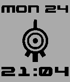
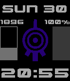

# pebble-codexana-wf
Code XANA watchface for Pebble watches

> Other screenshots available in the `screenshots` folder

## Features
- Configurable colors on colored displays
    - DarkMode available on B/W displays
- XANA eye appearance on bluetooth connection lost
    - Configurable color for colored displays (optional gray on B/W displays)
    - 'Void' appearance (center dot and inner circle hidden)
- Autoresize when timeline notification
- Optional vibration on disconnect

## Compatible watch models
- Aplite : OG Pebble, Pebble Steel
- Basalt : Pebble Time, Pebble Time Steel
- Chalk : Pebble Time Round
- Diorite : Pebble 2, Pebble 2 Duo (backward compatibility)

Other models will be compatible in future releases.

## Installation
Download [here](https://apps.rebble.io/en_US/application/691ccd3ff5dd2700091a4ff2) from the Pebble appstore.
Or sideload using the ` .pbw` file in the release section.

## Contributing
Issues and pull requests are welcome.
To build, install the pebble-sdk : [https://developer.repebble.com/sdk/](https://developer.repebble.com/sdk/)

## Thanks to
Daniel Zadorozny for his Gunship font (Character `1` has been modified)

Link to his website [http://www.iconian.com/](http://www.iconian.com/)